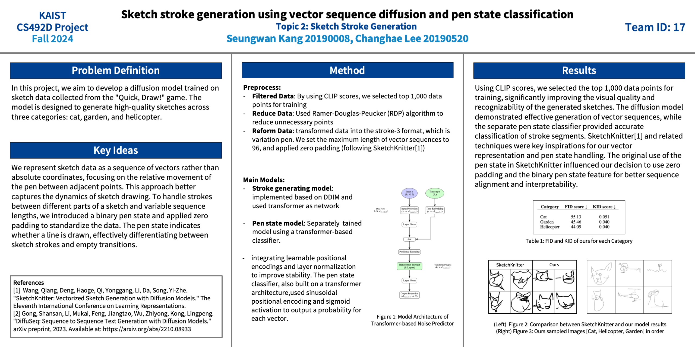

## Introduction

Our sketch generation model is modeled to sample sketch drawing. It generates penstate in sequential order. It is trained by real human data. We tested them in three categories (cat,helicopter,garden). As result, we could get around 50 FID and also check model generating meaningful drawing.

## Setting

```
conda create --name project python=3.8
conda activate project
pip install matplotlib dotmap pytorch_lightning h5py
pip install torch==2.1.0 torchvision==0.16.0 torchaudio==2.1.0 --index-url https://download.pytorch.org/whl/cu121
```

## Preliminary Backgrounds

1. Model [SketchKnitter](https://github.com/wangqiang9/SketchKnitter)
2. Data [Diffusion-Project-Drawing](https://github.com/KAIST-Visual-AI-Group/Diffusion-Project-Drawing)

## Implementation

Preprocessing: RDP algoritm, Convert to variation, Used top 1000 in CLIP order

Main Genearating **Pen-Variation Model**: Implement using DDIM and Transformer

Sub Predicting **Pen-State Model**: Implemented using Transformer

## Results



## Acknowledgements

This project is introduced in CS492d course by professor Minhyuk Sung and TA Yuseung Lee. Thanks for giving great change of modeling such project. And I also appreciate to my teammate [chlee973](https://github.com/chlee973)
